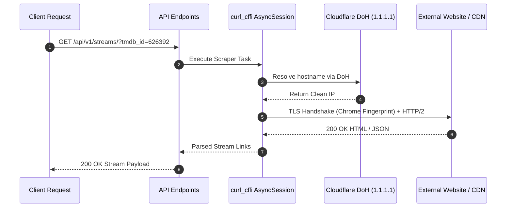
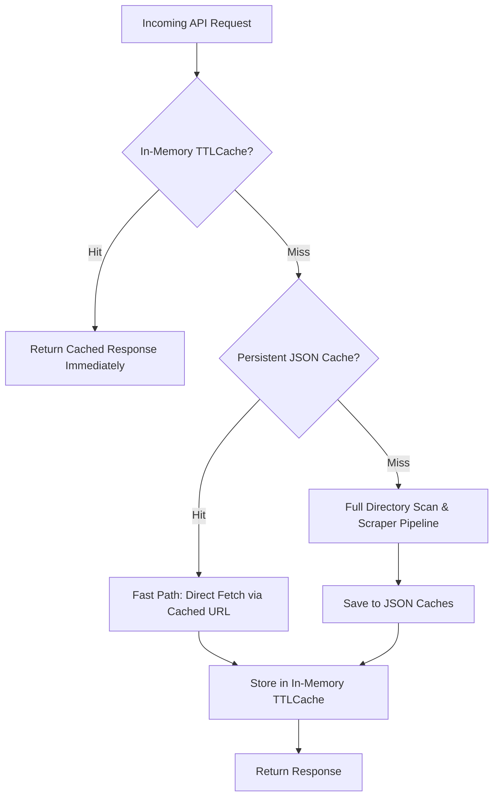

# Movie Streaming Backend - Architecture & Technical Reference

High-performance asynchronous FastAPI backend for movie & TV metadata discovery and resilient streaming source extraction. System integrates TMDb API v3, DNS-over-HTTPS (DoH) browser-impersonating HTTP sessions (`curl_cffi`), multi-tier TTL caching, dynamic domain mirror discovery, inline HTTP Range video streaming proxy.

---

## 1. System Architecture

### High-Level Architecture Diagram

```mermaid
flowchart TD
    Client(["Client Applications<br/>(Web / Mobile / TV App)"])

    subgraph FastAPI_Backend ["FastAPI Backend (app/)"]
        subgraph Routing_Layer ["API Routing (/api/v1)"]
            Main["app/main.py<br/>Lifespan & CORS"]
            MoviesRouter["app/api/v1/endpoints/movies.py<br/>/movies/*"]
            StreamsRouter["app/api/v1/endpoints/streams.py<br/>/streams/ & /streams/proxy/*"]
        end

        subgraph Core_Services ["Core & Services"]
            Config["app/core/config.py<br/>Settings (Pydantic)"]
            SessionManager["app/core/session.py<br/>curl_cffi AsyncSession + DoH (1.1.1.1)"]
            TMDBService["app/services/tmdb.py<br/>TMDBClient + In-Memory TTLCache"]
        end

        subgraph Scraper_Subsystem ["Scraping Subsystem (app/scrapers)"]
            ScraperMgr["app/scrapers/manager.py<br/>ScraperManager (3hr TTL Stream Cache)"]
            BaseScraper["app/scrapers/base.py<br/>BaseScraper (Abstract)"]
            IsaiminiScraper["app/scrapers/providers/isaimini.py<br/>IsaiminiScraper"]
        end

        subgraph Persistence ["Persistent JSON Caches"]
            DomainCache[("domain_cache.json<br/>Active Mirror")]
            PathCache[("movie_path_cache.json<br/>TMDb &rarr; Path & Page")]
            FileIdLog[("file_id_log.json<br/>Scraped File ID Telemetry")]
        end
    end

    subgraph External_Services ["External Providers & Upstream CDNs"]
        TMDB_API[("TMDb API v3<br/>api.themoviedb.org")]
        Mirrors[("Mirrors / Seed Hosts<br/>moviesdatamil / moviesda / isaimini")]
        StreamHosts[("Stream / Host CDN<br/>play.onestream.today / uptomkv")]
    end

    %% Client Interactions
    Client -->|Metadata Requests| MoviesRouter
    Client -->|Stream Extraction Request| StreamsRouter
    Client -->|HLS/MP4 Range Video Playback| StreamsRouter

    %% Routing to Core / Scrapers
    MoviesRouter --> TMDBService
    StreamsRouter --> TMDBService
    StreamsRouter --> ScraperMgr
    StreamsRouter -->|Proxy Stream Generator (Chunked 64KB)| StreamHosts

    %% Core Interactions
    TMDBService -->|DoH Impersonated GET| SessionManager
    SessionManager --> TMDB_API

    %% Scraper Orchestration
    ScraperMgr --> IsaiminiScraper
    IsaiminiScraper -.-> BaseScraper
    IsaiminiScraper -->|DoH Impersonated Requests| SessionManager
    SessionManager --> Mirrors
    SessionManager --> StreamHosts

    %% Caches
    IsaiminiScraper <--> DomainCache
    IsaiminiScraper <--> PathCache
    IsaiminiScraper --> FileIdLog
```

---

## 2. Directory Structure & File Responsibilities

```
/home/mukes/dev/movies/app
├── __init__.py                     # Package initialization
├── main.py                         # FastAPI app instance, Lifespan session management, CORS middleware, root status route
├── core/
│   ├── config.py                   # Pydantic BaseSettings loading .env (ApiKey, ReadAccessToken, DOH_URL)
│   ├── session.py                  # Global persistent AsyncSession with curl_cffi and Cloudflare DoH (1.1.1.1)
│   └── resolver.py                 # Deprecated legacy DNS resolver notes (superseded by curl_cffi)
├── api/
│   └── v1/
│       ├── api.py                  # Aggregator router mounting /movies and /streams endpoints
│       └── endpoints/
│           ├── movies.py           # Endpoints for TMDB search, popular, discover, and details
│           └── streams.py          # Endpoints for scraping stream links and reverse proxy streaming
├── services/
│   └── tmdb.py                     # TMDb API v3 integration with in-memory TTLCache for fast metadata retrieval
└── scrapers/
    ├── base.py                     # BaseScraper abstract base class defining standard provider contracts
    ├── manager.py                  # ScraperManager orchestrating concurrent scrapers, de-duplication, and 3-hour TTL caching
    ├── domain_cache.json           # Persistent cache storing the currently active mirror domain
    ├── movie_path_cache.json       # Persistent map of TMDb ID -> scraped movie path and directory page
    ├── file_id_log.json            # Telemetry audit log of discovered file IDs and stream qualities
    └── providers/
        └── isaimini.py             # Resilient scraper for Tamil movie sources with recursive crawler & token matcher
```

### Module Responsibilities Breakdown

| File Path | Primary Responsibility | Key Classes / Functions |
|---|---|---|
| [`app/main.py`](file:///home/mukes/dev/movies/app/main.py) | Application entrypoint, lifespan hooks initializing/closing HTTP sessions, CORS config, `/` status endpoint. | `lifespan()`, `read_root()` |
| [`app/core/config.py`](file:///home/mukes/dev/movies/app/core/config.py) | Environment configuration via Pydantic Settings. | `Settings`, `settings` |
| [`app/core/session.py`](file:///home/mukes/dev/movies/app/core/session.py) | Manages global persistent `curl_cffi.requests.AsyncSession` configured with `CurlOpt.DOH_URL` (`https://1.1.1.1/dns-query`). | `get_session()`, `init_session()`, `close_session()` |
| [`app/services/tmdb.py`](file:///home/mukes/dev/movies/app/services/tmdb.py) | TMDb API client with built-in `TTLCache`, response filtering (Tamil language, release dates). | `TTLCache`, `TMDBClient`, `tmdb_client` |
| [`app/scrapers/base.py`](file:///home/mukes/dev/movies/app/scrapers/base.py) | Abstract interface for movie & TV scraper providers. | `BaseScraper`, `scrape()` |
| [`app/scrapers/manager.py`](file:///home/mukes/dev/movies/app/scrapers/manager.py) | Coordinates parallel execution of registered scrapers, 3-hour TTL caching, deduplicates URLs, prioritizes direct streams. | `ScraperManager`, `scraper_manager` |
| [`app/scrapers/providers/isaimini.py`](file:///home/mukes/dev/movies/app/scrapers/providers/isaimini.py) | Multi-stage scraper for Isaimini/Moviesda network: domain mirror discovery, directory pagination batching, token matching, recursive quality crawling, HTML5 video link extraction. | `IsaiminiScraper`, `_resolve_moviesda_domain()`, `_crawl_movie_page()`, `_find_candidates_in_soup()` |
| [`app/api/v1/endpoints/movies.py`](file:///home/mukes/dev/movies/app/api/v1/endpoints/movies.py) | Movie and TV metadata discovery endpoints querying TMDb with structured responses. | `search_movies_or_tv()`, `get_popular()`, `discover()`, `get_details()` |
| [`app/api/v1/endpoints/streams.py`](file:///home/mukes/dev/movies/app/api/v1/endpoints/streams.py) | Stream resolution and high-performance HTTP range-supporting streaming proxy. | `get_streaming_links()`, `proxy_stream()` |

---

## 3. Environment Variables & Installation Guide

### Prerequisites
- Python 3.11+
- libcurl / OpenSSL dependencies (for `curl_cffi`)

### Environment Variables (`.env`)

Create `.env` file in project root `/home/mukes/dev/movies/.env`:

```env
# TMDb v3 API Key
ApiKey=your_tmdb_api_key_here

# TMDb v4 Read Access Token (Bearer token for API calls)
ReadAccessToken=your_tmdb_read_access_token_here

# Optional: DNS over HTTPS URL (defaults to https://1.1.1.1/dns-query)
DOH_URL=https://1.1.1.1/dns-query
```

### Installation Steps

1. **Clone/Navigate to repository**:
   ```bash
   cd /home/mukes/dev/movies
   ```

2. **Create and activate virtual environment**:
   ```bash
   python3 -m venv .venv
   source .venv/bin/activate
   ```

3. **Install dependencies**:
   ```bash
   pip install -r requirements.txt
   ```

4. **Run FastAPI server**:
   ```bash
   uvicorn app.main:app --host 0.0.0.0 --port 8000 --reload
   ```

5. **Verify server status**:
   ```bash
   curl http://127.0.0.1:8000/
   ```
   Expected response:
   ```json
   {
     "status": "online",
     "message": "Movie Streaming Backend API is running.",
     "docs_url": "/docs"
   }
   ```

---

## 4. Complete API Reference

Base URL prefix: `/api/v1`

Interactive OpenAPI Docs: `http://localhost:8000/docs` or `http://localhost:8000/redoc`

---

### 4.1 System & Health

#### `GET /`
Returns service availability and links to API documentation.

- **Response `200 OK`**:
```json
{
  "status": "online",
  "message": "Movie Streaming Backend API is running.",
  "docs_url": "/docs"
}
```

---

### 4.2 Movies & Metadata (`/api/v1/movies`)

#### `GET /api/v1/movies/search`
Search movies or TV shows on TMDb with automatic filtering for Tamil original titles and released content.

- **Query Parameters**:
  - `query` (*string*, required): Search term (e.g., `Master`, `Leo`).
  - `media_type` (*string*, optional, default: `"movie"`): Target media type (`movie` or `tv`).
  - `year` (*integer*, optional): Release year filter (or first air date year for TV).
  - `page` (*integer*, optional, default: `1`): Pagination page (minimum `1`).

- **Response `200 OK`**:
```json
{
  "results": [
    {
      "tmdb_id": 626392,
      "title": "Master",
      "original_title": "மாஸ்டர்",
      "overview": "An alcoholic professor is sent to a juvenile school, where he clashes with a ruthless gangster.",
      "release_date": "2021-01-13",
      "poster_path": "/x3Hj84a2g36dKqLzGfH1u.jpg",
      "backdrop_path": "/5NzF3R7z6X8q8w5E7gR9.jpg",
      "vote_average": 7.3,
      "media_type": "movie",
      "genre_ids": [28, 53]
    }
  ]
}
```

---

#### `GET /api/v1/movies/popular`
Fetch popular movies from TMDb matching language code.

- **Query Parameters**:
  - `language` (*string*, optional, default: `"en-US"`): ISO-639-1 language code (e.g., `ta-IN`, `en-US`, `hi-IN`).
  - `page` (*integer*, optional, default: `1`): Page number (minimum `1`).

- **Response `200 OK`**:
```json
{
  "results": [
    {
      "tmdb_id": 1153399,
      "title": "Coolie",
      "original_title": "கூலி",
      "overview": "A gold heist thriller directed by Lokesh Kanagaraj.",
      "release_date": "2025-05-01",
      "poster_path": "/coolie_poster.jpg",
      "backdrop_path": "/coolie_backdrop.jpg",
      "vote_average": 8.1,
      "original_language": "ta",
      "media_type": "movie",
      "genre_ids": [28, 80]
    }
  ]
}
```

---

#### `GET /api/v1/movies/discover`
Discover movies filtered by original language, release year, genre. When `year` omitted, results sorted by latest primary release date.

- **Query Parameters**:
  - `language` (*string*, optional, default: `"ta-IN"`): Language code (e.g., `ta-IN`, `hi-IN`).
  - `year` (*integer*, optional): Filter by primary release year. If supplied, sorted by `popularity.desc`; otherwise sorted by `primary_release_date.desc`.
  - `genre` (*integer*, optional): TMDb Genre ID (e.g. `28` for Action, `35` for Comedy).
  - `page` (*integer*, optional, default: `1`): Page number (minimum `1`).

- **Response `200 OK`**:
```json
{
  "results": [
    {
      "tmdb_id": 1544326,
      "title": "Nooru Sami",
      "original_title": "நூறு சாமி",
      "overview": "A drama exploring rural folklore and family bonds.",
      "release_date": "2026-02-14",
      "poster_path": "/nooru_sami.jpg",
      "backdrop_path": "/nooru_backdrop.jpg",
      "vote_average": 6.8,
      "original_language": "ta",
      "media_type": "movie",
      "genre_ids": [18]
    }
  ]
}
```

---

#### `GET /api/v1/movies/{media_type}/{tmdb_id}`
Retrieve full media metadata and external IDs (including IMDb ID) for title.

- **Path Parameters**:
  - `media_type` (*string*, required): `movie` or `tv`.
  - `tmdb_id` (*integer*, required): TMDb ID.

- **Responses**:
  - `200 OK`:
    ```json
    {
      "tmdb_id": 626392,
      "title": "Master",
      "imdb_id": "tt10579952",
      "overview": "An alcoholic professor is sent to a juvenile school...",
      "release_date": "2021-01-13",
      "poster_path": "/x3Hj84a2g36dKqLzGfH1u.jpg",
      "external_ids": {
        "imdb_id": "tt10579952",
        "wikidata_id": "Q85784232",
        "facebook_id": "MasterFilm"
      },
      "raw_details": {
        "id": 626392,
        "runtime": 178,
        "status": "Released",
        "tagline": "Master the blaster"
      }
    }
    ```
  - `400 Bad Request`: `{"detail": "Invalid media type. Must be 'movie' or 'tv'."}`
  - `404 Not Found`: `{"detail": "Media not found on TMDB."}`

---

### 4.3 Streams & Proxy (`/api/v1/streams`)

#### `GET /api/v1/streams/`
Scrapes and resolves streaming sources for movie or TV episode. Automatically rewrites direct upstream download URLs into proxy stream URLs.

- **Query Parameters**:
  - `tmdb_id` (*integer*, required): TMDb ID of movie or TV show.
  - `media_type` (*string*, optional, default: `"movie"`): `movie` or `tv`.
  - `season` (*integer*, optional): Season number (required if `media_type="tv"`).
  - `episode` (*integer*, optional): Episode number (required if `media_type="tv"`).
  - `bypass_cache` (*boolean*, optional, default: `false`): Force re-scrape bypassing 3-hour cache.

- **Responses**:
  - `200 OK`:
    ```json
    {
      "title": "Master",
      "year": 2021,
      "media_type": "movie",
      "tmdb_id": 626392,
      "imdb_id": "tt10579952",
      "season": null,
      "episode": null,
      "cache_expires_in": 10740,
      "streams": [
        {
          "provider": "Original (1080p)",
          "url": "http://localhost:8000/api/v1/streams/proxy/stream.mp4?url=https%3A%2F%2Fplay.onestream.today%2Fdownload.php%3Ffile%3D12345",
          "quality": "1080p",
          "type": "direct",
          "subtitles": []
        },
        {
          "provider": "Original (720p)",
          "url": "http://localhost:8000/api/v1/streams/proxy/stream.mp4?url=https%3A%2F%2Fplay.onestream.today%2Fdownload.php%3Ffile%3D12346",
          "quality": "720p",
          "type": "direct",
          "subtitles": []
        }
      ]
    }
    ```
  - `400 Bad Request`: `{"detail": "Season and Episode are required for TV shows."}`
  - `404 Not Found`: `{"detail": "Movie not found on TMDB."}`
  - `500 Internal Server Error`: `{"detail": "Internal scraper failure occurred."}`

---

#### `GET /api/v1/streams/proxy` and `GET /api/v1/streams/proxy/{filename}`
High-efficiency reverse streaming proxy for video media files.

- **Query Parameters**:
  - `url` (*string*, required): Target upstream video URL (URL-encoded).
- **Path Parameters**:
  - `filename` (*string*, optional): Dummy filename (e.g. `stream.mp4` or `master.mp4`) for video player format detection.

- **Key Features**:
  1. **HTTP Range Support (`206 Partial Content`)**: Supports seeking forward and backward in native HTML5 and native mobile/TV media players by forwarding `Range` headers.
  2. **CORS & IP-Lock Bypass**: Masks upstream origin, injects valid `Referer` headers (`https://cdn.uptomkv.ch/`).
  3. **302 Redirect Pre-resolution**: Detects HTTP `301/302/303/307/308` hops (e.g. `download.php` redirecting to host CDNs) before initiating chunked transmission, preserving Range headers across redirects.
  4. **Inline Playback**: Enforces `Content-Disposition: inline` for direct browser streaming without download prompts.
  5. **Proxy Loop Prevention**: Automatically strips nested proxy URLs.
  6. **Streaming Memory Safety**: Streams in `64 KB` chunks using `httpx.AsyncClient` generator without buffering multi-gigabyte files in RAM.

- **Responses**:
  - `200 OK` / `206 Partial Content`: Binary video stream chunk (`video/mp4` / `video/x-matroska`).
  - `400 Bad Request`: `{"detail": "Missing url parameter."}`
  - `500 Internal Server Error`: `{"detail": "Proxy error: <error_message>"}`

---

## 5. Internal Workflows & Core Mechanisms

### 5.1 TLS & DNS Resolution via `curl_cffi`

Standard Python `httpx` or `requests` encounter DNS hijacking, ISP blocks, IPv6 connection timeouts, Cloudflare TLS fingerprinting blocks.

Backend utilizes `curl_cffi`:
1. **Cloudflare DNS-over-HTTPS (DoH)**: Built-in `CurlOpt.DOH_URL: b"https://1.1.1.1/dns-query"` resolves domains directly via secure encrypted DNS, bypassing ISP DNS manipulation.
2. **Browser Impersonation (`impersonate="chrome"`)**: Emulates Chrome TLS fingerprint (JA3/JA4 fingerprints, cipher suites, ALPN, HTTP/2 settings).
3. **Persistent Session Pooling**: `init_session()` in [`app/core/session.py`](file:///home/mukes/dev/movies/app/core/session.py) creates shared `AsyncSession` reused across requests, significantly reducing connection latency.



---

### 5.2 Multi-Tier In-Memory and Persistent Caching



| Cache Layer | Scope & Storage | Key / TTL | Purpose |
|---|---|---|---|
| `TMDBClient._search_cache` | In-Memory `TTLCache` | `f"{query}_{year}_{page}"`<br/>**1 Hour** (3,600s) | Prevents redundant TMDb search calls for identical query terms. |
| `TMDBClient._details_cache` | In-Memory `TTLCache` | `movie_id` or `tv_id`<br/>**24 Hours** (86,400s) | Caches full TMDb metadata and external IMDb IDs. |
| `TMDBClient._popular_cache` | In-Memory `TTLCache` | `f"{language}_{page}"`<br/>**24 Hours** (86,400s) | Caches popular titles list. |
| `TMDBClient._discover_cache` | In-Memory `TTLCache` | `f"{language}_{year}_{genre}_{page}"`<br/>**24 Hours** (86,400s) | Caches filtered discovery lists. |
| `ScraperManager._stream_cache` | In-Memory `TTLCache` | `f"{tmdb_id}_{season}_{episode}"`<br/>**3 Hours** (10,800s) | Eliminates scraping latency for recently accessed streams. |
| `domain_cache.json` | Disk File JSON | Key: `"isaimini"`<br/>**Persistent** | Stores active mirror domain discovered via seed mirror redirects. |
| `movie_path_cache.json` | Disk File JSON | Key: `str(tmdb_id)` &rarr; `{"path": str, "page": int}`<br/>**Persistent** | Stores exact URL path and directory page for scraped movies. |
| `file_id_log.json` | Disk File JSON | Array of `{tmdb_id, title, file_id, quality, timestamp}`<br/>**Persistent** | Audits scraped file IDs. |

---

### 5.3 Isaimini Scraper Execution Pipeline

[`app/scrapers/providers/isaimini.py`](file:///home/mukes/dev/movies/app/scrapers/providers/isaimini.py) executes multi-stage pipeline:

1. **Domain Mirror Discovery**:
   - Checks `domain_cache.json`.
   - Pings active cached domain. If unreachable or redirected, iterates `SEED_MIRRORS`:
     - `https://moviesdatamil.net/`
     - `https://moviesda33.com/`
     - `https://isaimini.com.in/`
   - Extracts base domain from final redirected URL and updates `domain_cache.json`.

2. **Movie Path Resolution**:
   - **Fast Path**: Checks `movie_path_cache.json`. If present, jumps directly to target movie page.
   - **Directory Scan**: If unvisited, fetches `tamil-{year}-movies/` and discovers total page count.
   - **Parallel Page Batching**: Fetches directory pages in batches of 8 using `asyncio.gather()`.
   - **Token Matching Engine**:
     - Extracts alphanumeric tokens from search title and candidate HTML `<a>` tags.
     - Ignores blacklisted terms (`songs`, `mp3`, `bgm`, `ringtone`, `trailer`, `telegram`, etc.).
     - Computes token overlap and strict subset matching.
     - Sorts candidates with scoring metric: `(extra_tokens ASC, page ASC)`.
     - Writes newly discovered path and page to `movie_path_cache.json`.

3. **Recursive Quality Crawling**:
   - Traverses HTML links (`_crawl_movie_page()`) up to recursion depth 3.
   - Handles quality subfolders (`Original`, `PreDVD`, `HD`, `Tamil`, `Dubbed`).
   - Identifies resolution tokens (`1080p`, `720p`, `640x360`, `480p`, `360p`).

4. **Print Category Detection**:
   - Inspects `quality:` text tags and URL tokens to classify prints (`HQ PreDVD`, `PreDVD`, `WEB-DL`, `HDRip`, `Original`).

5. **Video Source Extraction**:
   - Extracts download file URLs matching `/download/file/(\d+)`.
   - Resolves player pages on `https://play.onestream.today/stream/page/{file_id}`.
   - Parses `<source src="...">` tag for direct HTML5 streaming URL.
   - Falls back to player embed URL if direct extraction protected.
   - Deduplicates and returns formatted stream objects.

---

## 6. Error Handling & Edge Cases

| Scenario | Handling Strategy |
|---|---|
| **Upstream Mirror Blocked / Offline** | Scraper attempts cached domain, logs warning on timeout (5s), cascades across `SEED_MIRRORS` list. Updates disk cache on first successful 200 OK. |
| **ISP / Network DNS Poisoning** | `curl_cffi` routes DNS lookups through Cloudflare DoH (`1.1.1.1`), bypassing local resolver corruption. |
| **Movie Missing or Unreleased** | TMDB query returns empty list if release date > current date or non-Tamil. Scraper returns empty results `[]` gracefully without crashing. |
| **Video Player Seeks (Range Requests)** | `proxy_stream` forwards HTTP `Range` headers to upstream host, passes through `206 Partial Content`, streams exact byte ranges. |
| **302 Redirect on Upstream File Hosts** | `download.php` often responds with 302 to external CDNs (`mv1.uptomkv.ch`). Proxy pre-resolves redirects using lightweight non-following GET, encodes destination location, streams directly from final origin. |
| **Proxy URL Nesting / Loops** | If proxied URL supplied to `/proxy`, iteratively unwraps embedded `?url=` query parameters to prevent recursive proxying. |
| **Scraper Exception During Orchestration** | `asyncio.gather(*tasks, return_exceptions=True)` catches provider errors individually, logs stack traces, aggregates remaining healthy providers. |
| **Graceful Server Shutdown** | Lifespan context manager in `main.py` ensures `_session.close()` called on SIGTERM / SIGINT to close open network sockets. |

---

## 7. Testing & Verification Guide

### 1. Test Server Startup & Health
```bash
curl -i http://localhost:8000/
```

### 2. Test Movie Metadata Search
```bash
curl -i "http://localhost:8000/api/v1/movies/search?query=Master&media_type=movie&year=2021"
```

### 3. Test Discover Endpoint
```bash
curl -i "http://localhost:8000/api/v1/movies/discover?language=ta-IN&year=2025"
```

### 4. Test Stream Link Resolution
```bash
curl -i "http://localhost:8000/api/v1/streams/?tmdb_id=626392&media_type=movie"
```

### 5. Test Video Stream Proxy Range Request
```bash
curl -i -H "Range: bytes=0-1048576" "http://localhost:8000/api/v1/streams/proxy/stream.mp4?url=https%3A%2F%2Fplay.onestream.today%2Fdownload.php%3Ffile%3D12345"
```
*(Verify response headers return `HTTP/1.1 206 Partial Content`, `Content-Range: bytes 0-1048576/...`, `Content-Type: video/mp4`)*
